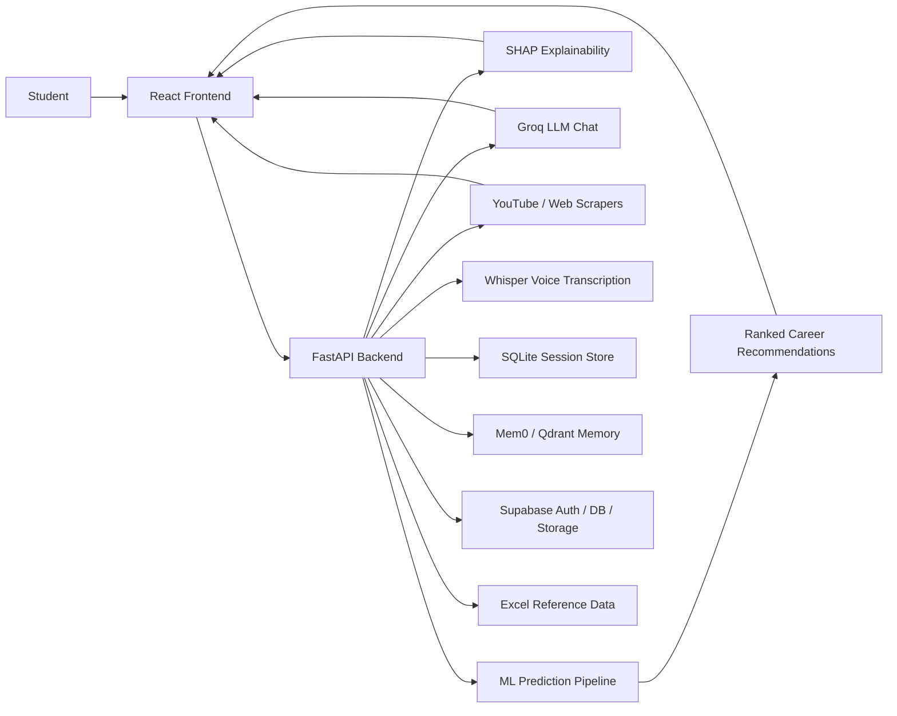
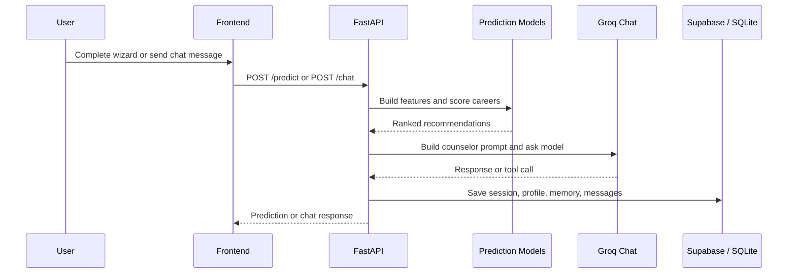
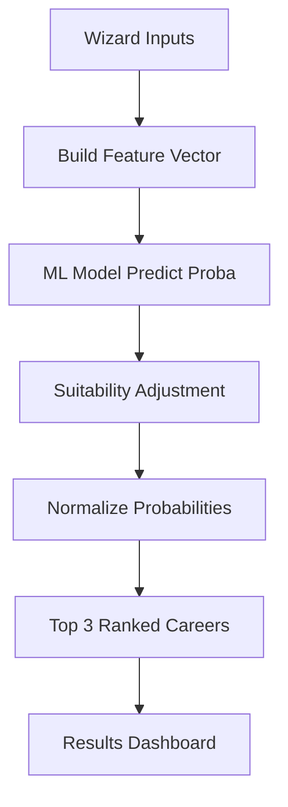
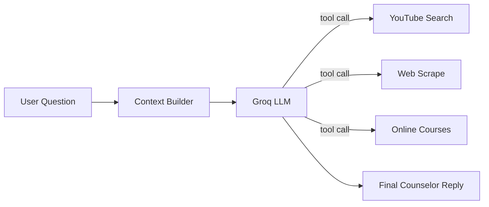

# FuturePath

FuturePath is a full-stack AI career counseling platform for Pakistani students. It combines an ML-based career recommender, a FastAPI backend, a React/Vite frontend, Supabase authentication and persistence, local memory with Mem0/Qdrant, YouTube and web resource search, voice transcription, PDF export, and explainable AI outputs.

The system is designed to guide students from assessment to recommendation to action plan:

1. Complete the assessment wizard.
2. Receive a ranked career prediction.
3. Review the explanation, roadmap, universities, skills, and salary context.
4. Chat with the AI counselor for follow-up guidance.
5. Save sessions, export reports, and bookmark resources.

---

## Project Highlights

- Career prediction using trained ML models: XGBoost, voting ensemble, and stacking ensemble.
- Explainability via SHAP for XGBoost-based reasoning.
- AI counselor chat powered by Groq LLM with tool calling and fallback logic.
- Live YouTube search, scholarship lookup, and course discovery.
- Voice input through Whisper transcription.
- Supabase-backed auth, profile storage, chat history, and resources.
- SQLite session storage and PDF report export.
- React dashboard with charts, roadmap pages, and chat interface.

---

## Repository Layout

```text
futurepath/
|-- api/                    # FastAPI backend
|   |-- main.py             # API entry point and route definitions
|   |-- auth.py             # Supabase auth helpers
|   |-- memory.py           # Mem0/Qdrant memory integration
|   |-- voice.py            # Whisper transcription
|   |-- chat_db.py          # Conversation persistence helpers
|   |-- student_db.py       # Student profile helpers
|   |-- supabase_client.py  # Supabase client factory
|   |-- system_prompt.py    # Counselor prompt builder
|   |-- scrapers/           # Search and scraping utilities
|   `-- tests/              # API and integration tests
|-- frontend/               # React + Vite frontend
|   |-- src/pages/          # Pages for wizard, results, chat, etc.
|   |-- src/components/     # Shared UI components
|   |-- src/lib/            # API and Supabase client wrappers
|   `-- src/contexts/       # Auth context
|-- data/                   # Dataset, local memory DB, and project assets
|-- models/                 # Saved model artifacts
|-- notebooks/              # EDA, preprocessing, and training notebooks/scripts
|-- reports/                # Model performance and EDA outputs
`-- README.md               # This file
```

---

## System Architecture



### Request Flow



---

## Frontend Overview

The frontend is a Vite + React application located in `frontend/`.

### Main Pages

- `Home.jsx` - landing page and entry point.
- `Wizard.jsx` - career assessment flow.
- `DetailedResults.jsx` - ranked results, SHAP explanation, and action plan.
- `ChatDashboard.jsx` - AI counselor chat, history, voice capture, and resource actions.
- `Roadmap.jsx` - roadmap view for a specific career.
- `About.jsx` and `Contact.jsx` - informational pages.
- `Auth/Login.jsx` and `Auth/Register.jsx` - authentication screens.
- `MindMap.jsx` - mind-map generation view.

### Frontend Capabilities

- Protected routing for authenticated areas.
- Supabase auth session handling.
- API client wrapper for backend communication.
- Visual analytics with Recharts and Cytoscape.
- Voice recording and transcription hooks.
- Bookmarks and saved resources.

### Frontend Tech Stack

- React 19
- Vite
- React Router
- Axios
- Tailwind CSS
- Framer Motion
- Recharts
- Cytoscape
- Lucide icons

---

## Backend Overview

The backend is a FastAPI service located in `api/`.

### Main Responsibilities

- Load trained model artifacts at startup.
- Build feature vectors from assessment inputs.
- Produce ranked career recommendations.
- Generate SHAP explanations.
- Serve roadmap, scholarship, course, and university context.
- Manage counselor chat, memory, and tool usage.
- Persist user sessions and saved resources.
- Support voice transcription and PDF export.

### Core Backend Modules

- `main.py` - application entry point and routes.
- `memory.py` - Mem0 storage and search.
- `auth.py` - Supabase authentication helpers.
- `supabase_client.py` - public and service-role clients.
- `student_db.py` - student profile CRUD helpers.
- `chat_db.py` - conversations and messages.
- `audio_storage.py` - voice clip upload.
- `voice.py` - Whisper transcription.
- `system_prompt.py` - structured counselor prompt.
- `scrapers/` - live resource discovery.

### Runtime Data Sources

- `models/` - serialized ML artifacts.
- `data/FuturePath_Dataset_Cleaned.csv` - project dataset.
- `data/career_counseling_full_dataset.xlsx` - reference workbook.
- `data/local_memory_db/` - local Mem0/Qdrant storage.
- SQLite database for session and cache persistence.

---

## ML Prediction Pipeline

FuturePath uses a multi-step ranking pipeline rather than a single scalar score.

1. The wizard collects academic, aptitude, personality, interest, and activity inputs.
2. The backend builds a feature frame using the trained preprocessing layout.
3. A model is selected: XGBoost, voting ensemble, or stacking ensemble.
4. Raw class probabilities are produced for all career classes.
5. Probabilities are adjusted using suitability rules based on interests and aptitude.
6. Results are normalized and the top three careers are selected.
7. A category diversity filter prevents the list from collapsing into one cluster.
8. The top career is stored as the primary recommendation.

### Prediction Meaning

The percentage shown in the results page is the probability of the final ranked recommendation after post-processing, not a separate "model accuracy" score.



### Explainability

SHAP explanations are generated for the XGBoost model and grouped into high-level categories such as:

- Academic Stream
- Academic Marks
- Aptitude Test
- Personality Profile
- RIASEC Interests
- Activity and Fit

These grouped explanations are displayed in the detailed results view so students can understand why a career was recommended.

---

## Chatbot and Resource Discovery

The chat experience in `ChatDashboard.jsx` connects to `/chat` and can respond with:

- career roadmap guidance
- university suggestions
- scholarship information
- skill gap guidance
- market and salary context
- YouTube learning videos
- web-based course and scholarship resources

### Chat System Inputs

- Current message
- City
- Recommended career
- Optional prior conversation history
- Optional authenticated user context

### Chat Back-End Behavior

- Builds a structured student context from profile and prediction data.
- Retrieves memory from Mem0/Qdrant when available.
- Injects reference content from the Excel workbook.
- Uses Groq LLM with tool-calling for live resource discovery.
- Falls back to rule-based answers when the model is unavailable.

### Resource Tools

- YouTube video search via the official YouTube Data API.
- Scholarship scraping via static and dynamic scrapers.
- Udemy and other course discovery via Playwright-based scraping.



---

## Data and Persistence

FuturePath uses multiple persistence layers depending on the feature:

| Layer | Purpose | Storage |
|---|---|---|
| Supabase Auth | Login, registration, Google OAuth | Supabase |
| Student Profiles | Profile and assessment state | Supabase tables |
| Chat Conversations | Threaded counselor conversations | Supabase tables |
| Audio Clips | Voice clip uploads | Supabase Storage |
| Session Cache | Prediction session snapshots | SQLite |
| Memory | Long-term chat memory | Local Qdrant via Mem0 |
| Reference Data | Roadmaps, scholarships, salaries, courses | Excel workbook |

---

## API Overview

### Health and Prediction

- `GET /health` - health check.
- `GET /options` - wizard dropdown values.
- `POST /predict` - career prediction endpoint.
- `GET /roadmap?career=...` - roadmap lookup.
- `POST /shap` - SHAP explanation generation.

### Chat and Resources

- `POST /chat` - AI counselor chat.
- `POST /search` - resource search orchestration.
- `POST /voice` - voice transcription.
- `POST /generate-mindmap` - mind map generation.
- `POST /generate-mindmap/file` - mind map from file input.

### Persistence and User Data

- `POST /save_session` - save prediction session.
- `POST /export_pdf` - generate PDF report.
- `POST /save_resource` - bookmark resource.
- `GET /saved_resources` - list bookmarks.
- `POST /save_entry_test_score` - save test score.
- `GET /entry_test_scores` - fetch saved scores.

### Auth and Profiles

- `POST /auth/register`
- `POST /auth/login`
- `GET /auth/google`
- `GET /profile`
- `PATCH /profile`
- `GET /conversations`
- `GET /conversations/{id}/messages`

---

## Environment Variables

Create a local `.env` file at the project root used by the backend and a separate frontend `.env` if needed.

### Backend

| Variable | Purpose |
|---|---|
| `GROQ_API_KEY` | Primary LLM key for chat and assistant features |
| `GROQ_API_KEY2` | Secondary Groq key used by some auxiliary routes |
| `SUPABASE_URL` | Supabase project URL |
| `SUPABASE_ANON_KEY` | Public Supabase client key |
| `SUPABASE_SERVICE_ROLE_KEY` | Admin Supabase key for backend writes |
| `FRONTEND_URL` | Allowed frontend origin for CORS |
| `YOUTUBE_API_KEY` | YouTube Data API key |

### Frontend

| Variable | Purpose |
|---|---|
| `VITE_API_BASE_URL` | Backend URL, usually `http://127.0.0.1:8000` |
| `VITE_SUPABASE_URL` | Supabase frontend client URL |
| `VITE_SUPABASE_ANON_KEY` | Supabase anon key for browser auth |

Example backend `.env`:

```env
GROQ_API_KEY=your_groq_key
GROQ_API_KEY2=your_optional_second_groq_key
SUPABASE_URL=https://your-project.supabase.co
SUPABASE_ANON_KEY=your_anon_key
SUPABASE_SERVICE_ROLE_KEY=your_service_role_key
FRONTEND_URL=http://localhost:5173
YOUTUBE_API_KEY=your_youtube_api_key
```

Example frontend `.env`:

```env
VITE_API_BASE_URL=http://127.0.0.1:8000
VITE_SUPABASE_URL=https://your-project.supabase.co
VITE_SUPABASE_ANON_KEY=your_anon_key
```

---

## Setup and Run

### Backend

```powershell
cd "d:\career c fyp\futurepath\api"
pip install -r requirements.txt
python -m uvicorn main:app --reload --host 127.0.0.1 --port 8000
```

### Frontend

```powershell
cd "d:\career c fyp\futurepath\frontend"
npm install
npm run dev
```

### Access URLs

- Frontend: `http://localhost:5173`
- Backend: `http://127.0.0.1:8000`
- API docs: `http://127.0.0.1:8000/docs`

---

## Recommended Supabase Setup

1. Create a Supabase project.
2. Apply `api/schema.sql` in the SQL editor.
3. Create the `voice-clips` storage bucket.
4. Add the Supabase env variables to the backend and frontend.
5. Confirm Google OAuth if you plan to use social login.

---

## Testing

Available backend tests are located in `api/tests/` and cover API behavior, ML pipeline checks, E2E prediction, CORS/chat validation, and Postman collection assets.

Typical checks:

```powershell
cd "d:\career c fyp\futurepath\api"
pytest
```

If you only want a quick validation of the running backend, test:

- `GET /health`
- `POST /predict`
- `POST /chat`

---

## Known Limitations and Current Risks

- The project relies on external keys for Groq, Supabase, and YouTube.
- Mem0/Qdrant memory can fail if the local vector store is stale or incompatible.
- Several features depend on Supabase tables and buckets being created first.
- The repository contains generated model and data artifacts, so the `.gitignore` should be used carefully when pushing to GitHub.
- Production hardening is still limited: rate limiting, HTTPS enforcement, and deployment automation are not yet included.

---

## Notes for the Dissertation / FYP

This project is suitable for a final-year project report because it combines:

- machine learning classification and ranking
- explainable AI
- retrieval and memory systems
- conversational AI
- authenticated user workflows
- document generation and resource discovery

Suggested dissertation chapters:

1. Problem statement and motivation.
2. Data collection and preprocessing.
3. Model training and evaluation.
4. System architecture and implementation.
5. Chatbot, memory, and resource discovery.
6. User study and limitations.
7. Future work.

---

## Screenshots to Add Later

If you want a submission-ready README, add screenshots for:

- landing page
- wizard flow
- results dashboard
- chat counselor
- roadmap view
- PDF export

---

## Suggested Future Improvements

- Add Docker and docker-compose.
- Add CI/CD for backend and frontend.
- Add unit and integration tests.
- Add mobile menu polish and error states.
- Add a dedicated profile page and conversation history viewer.
- Restrict CORS for production.
- Add model evaluation tables and confusion matrices to the report.

---

## License and Attribution

This project appears to be a dissertation/FYP system. If you publish it publicly, make sure to review the licenses for third-party dependencies, model artifacts, and any data sources included in the repository.
