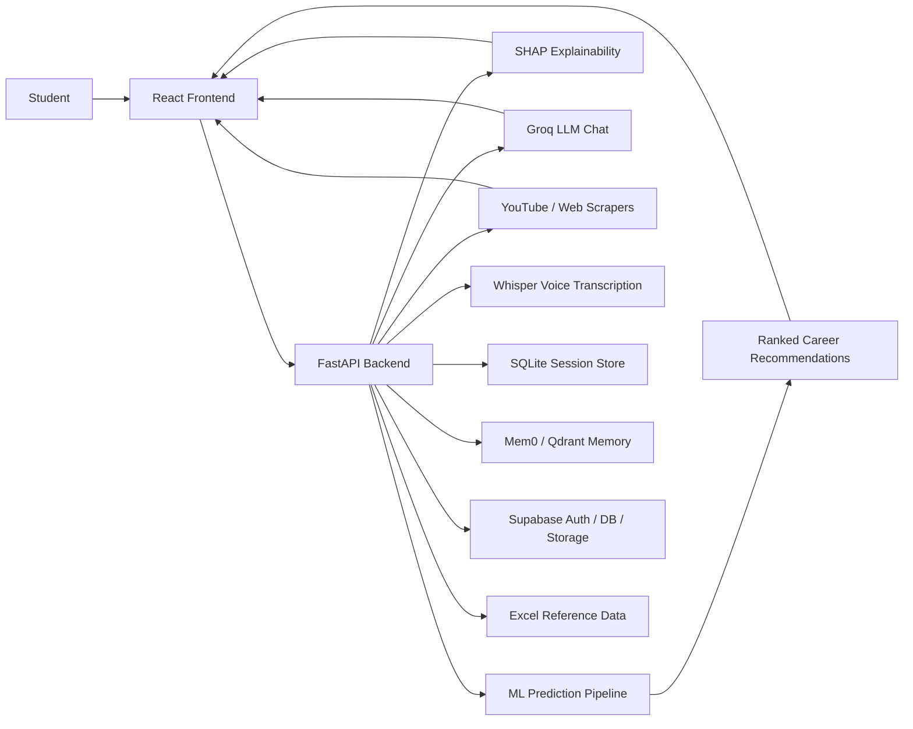
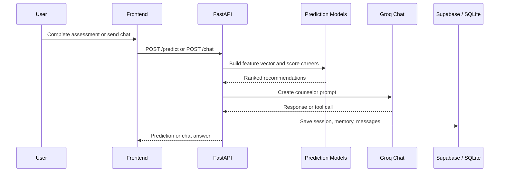

# FuturePath Poster Brief

Use this file as the content source for generating a conference/FYP poster. Add the dashboard screenshot and QR codes separately.

---

## 1. Poster Title

**FuturePath: An Explainable AI Career Guidance Platform for Pakistani Students**

Optional subtitle:

**A full-stack system for career prediction, explanation, counselor chat, and live resource discovery**

---

## 2. Project Summary

FuturePath is a full-stack AI career counseling platform designed for Pakistani students at Matric/FSc level. It predicts suitable careers using machine learning, explains the recommendation using SHAP, and gives practical follow-up support through an AI counselor chat, roadmap guidance, university suggestions, scholarships, YouTube videos, course search, voice input, and PDF report export.

The system connects a React frontend, FastAPI backend, trained ML models, Supabase authentication and persistence, Mem0 local memory, and live web resource tools into one end-to-end counseling workflow.

---

## 3. Problem Statement

Many students choose careers with limited guidance, fragmented online information, and little understanding of their own strengths. Existing tools usually provide either static advice or generic AI answers, but not a complete system that combines:

- aptitude and personality assessment
- career prediction
- explainable recommendations
- live learning resources
- secure session storage and chat history

FuturePath solves this by turning student data into ranked career guidance with practical next steps.

---

## 4. Objectives

- Predict suitable careers from academic, aptitude, personality, interest, and activity inputs.
- Explain the prediction using SHAP-based reasoning.
- Provide an AI counselor chat for personalized follow-up guidance.
- Show roadmaps, universities, skills, salaries, scholarships, and courses.
- Support YouTube learning video search and resource bookmarking.
- Store student sessions, profiles, conversations, and bookmarks securely.

---

## 5. Proposed Solution

FuturePath works as a guided decision-support system:

1. Student completes an assessment wizard.
2. Backend builds features and runs trained ML models.
3. The system ranks the best matching careers.
4. SHAP explains why the top career fits.
5. The dashboard shows roadmap, universities, skills, and salary context.
6. The AI counselor answers follow-up questions using memory and web tools.

---

## 6. System Architecture

### Architecture Notes

- Frontend: React + Vite + Tailwind CSS.
- Backend: FastAPI + Python.
- Prediction: XGBoost, voting ensemble, stacking ensemble.
- Explainability: SHAP.
- Chat: Groq LLM with tool calling and fallback.
- Storage: Supabase, SQLite, Mem0/Qdrant.
- Resources: YouTube Data API, web scraping, scholarship/course lookup.

---

## 7. Demo Flow

---

## 8. Tools and Technologies

### Frontend

- React 19
- Vite
- React Router
- Axios
- Tailwind CSS
- Framer Motion
- Recharts
- Cytoscape
- Lucide icons

### Backend and ML

- FastAPI
- Python
- NumPy
- Pandas
- Scikit-learn
- XGBoost
- LightGBM
- CatBoost
- SHAP
- Sentence Transformers
- Joblib

### AI / Data / Storage

- Groq LLM
- Supabase Auth / DB / Storage
- SQLite
- Mem0
- Qdrant
- Whisper
- ReportLab
- YouTube Data API
- Playwright

---

## 9. Key Features

- Career assessment wizard
- Ranked prediction with top 3 recommendations
- Match confidence shown on the results dashboard
- SHAP explanation cards and grouped reasoning
- Roadmap, skills, universities, and salary guidance
- AI counselor chat
- Voice transcription and voice-friendly chat
- YouTube learning video search
- Scholarship and course discovery
- Saved bookmarks and conversation history
- PDF report export

---

## 10. Screenshot / Visual Section

### Use these visuals in the poster

1. **Dashboard Screenshot**: show the prediction page with the ranked careers, confidence cards, and explanation panel.
2. **Chat Screenshot**: show the AI counselor conversation panel.
3. **Architecture Diagram**: use the mermaid diagram above or redraw it cleanly.
4. **Results Screenshot**: include SHAP chart, radar chart, or ranked careers.

### Screenshot caption suggestion

**Dashboard output showing ranked career recommendations, match confidence, and explanation cards.**

### If you only use one screenshot

Use the detailed results dashboard because it shows the strongest visual story of the project.

---

## 11. Results and Evaluation

Use the metrics below on the poster:

| Model | Accuracy | Macro-F1 | Top-3 Accuracy |
|---|---:|---:|---:|
| LightGBM | 76.02% | 77.34% | 93.49% |
| XGBoost | 75.32% | 76.70% | 93.56% |
| CatBoost | 73.79% | 74.81% | 92.36% |
| RandomForest | 76.93% | 78.10% | 94.17% |
| Stacking Ensemble | 76.37% | 77.72% | 93.17% |

### Within-stream accuracy

- Pre-Medical: best model around 77.89% within-stream accuracy.
- ICS: best model around 79.32% within-stream accuracy.
- Pre-Engineering: best model around 72.98% within-stream accuracy.
- Arts: best model around 78.86% within-stream accuracy.

### Important note for the poster

The percentage shown on the results dashboard is the post-processed probability of the final ranked career, not a raw model accuracy score.

---

## 12. Poster Content for the Three Main Columns

### Left Column

#### Problem Statement

Students need a single platform that predicts careers, explains them, and points them to real resources.

#### Objectives

- Predict careers
- Explain recommendations
- Support counseling chat
- Provide live resources

#### Proposed Solution

FuturePath combines assessment, ML ranking, explainability, and live guidance in one platform.

### Center Column

#### System Architecture / Methodology

- Frontend collects user input.
- Backend builds features and scores the career classes.
- SHAP explains the chosen recommendation.
- Chatbot uses context, memory, and live tools.

#### Tools and Technologies

- Python, FastAPI, React, Vite, Supabase, Groq, SHAP, Whisper, SQLite, Mem0, Qdrant.

#### Results and Testing

- Add the model metrics table.
- Add the detailed results dashboard screenshot.
- Add SHAP or radar chart visual.

### Right Column

#### Final Product / Demo Flow

1. Fill the wizard
2. Get ranked careers
3. Read the explanation
4. Chat with counselor
5. Open roadmap/resources

#### Contribution / Innovation

- Combines ML, XAI, and conversational support.
- Uses Pakistani education context.
- Includes live YouTube and scholarship discovery.
- Persists user history and bookmarks.

#### Future Work

- Add stronger evaluation and testing
- Add deployment and CI/CD
- Add mobile UX improvements
- Add a dedicated profile/conversation page

---

## 13. Suggested Titles for Sections on the Poster

- Problem Statement
- Objectives
- Proposed Solution
- System Architecture
- Tools and Technologies
- Results and Testing
- Contribution and Innovation
- Future Work

---

## 14. QR Code Targets

Create QR codes for:

- GitHub repository
- Demo video
- Project documentation / README

Suggested labels:

- **GitHub Repo**
- **Demo Video**
- **Documentation**

---

## 15. Design Recommendations

- Poster size: 16:9 widescreen.
- Use a dark navy or charcoal background with cyan and mint accent colors.
- Keep a 3-column layout.
- Use 3 to 4 colors maximum.
- Keep paragraphs short and use bullet points.
- Add at least one large dashboard screenshot.
- Add one architecture diagram.
- Add one results table or chart.
- Leave space for QR codes in the bottom-right area.

### Font suggestions

- Title: Aptos Display, Calibri, Arial, or Montserrat.
- Headings: Aptos, Calibri, Arial, or Poppins.
- Body: Calibri, Arial, Aptos, or Times New Roman.

### Font size suggestions for 16:9 poster

- Main title: 44–56 pt
- Student names / supervisor: 22–28 pt
- Section headings: 26–34 pt
- Body text: 18–22 pt
- Captions / labels: 14–16 pt

---

## 16. Short Abstract for the Poster

FuturePath is an explainable AI career counseling platform for Pakistani students. It uses machine learning to predict suitable careers from student profiles, SHAP to explain the recommendation, and an AI counselor chat to provide roadmaps, universities, scholarships, courses, and learning videos. The system connects a React frontend, FastAPI backend, Supabase storage, local memory, and live web resources into one practical decision-support platform.

---

## 17. One-Line Takeaway

**FuturePath helps students understand themselves, see their best career options, and take action with guided, explainable AI support.**
